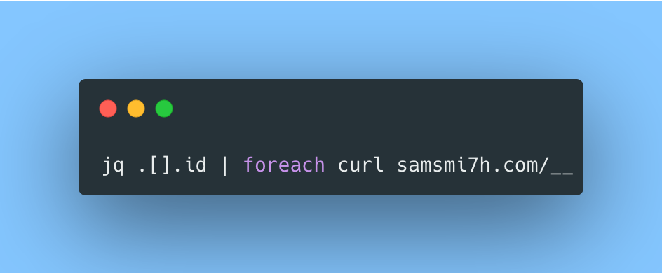

# For Each
Supercharge your shell one-liners with a straightforward `foreach` idiom.

This CLI tool can take from a pipe any list, and iterates over it using any command you wish.

Like `xargs` for the 21st Century.

[Check the docs](samsmi7h.com/oss/foreach)

